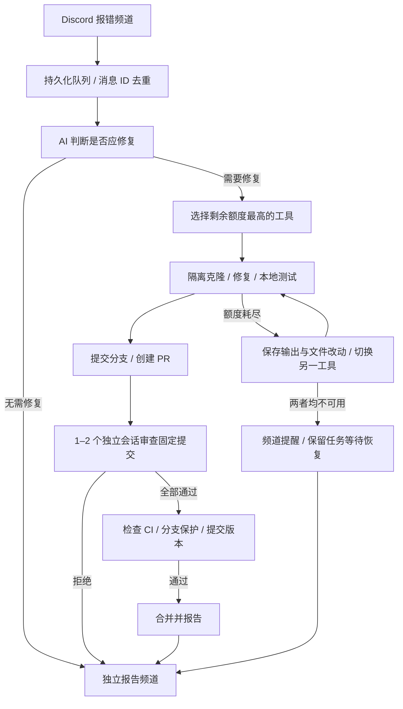

# Discord 自动修复机器人

监听指定 Discord 文字频道中的报错，判断是否值得改代码，使用本机 Codex / Claude Code 修复 GitHub 仓库，创建 PR，启动 1–2 个独立会话审查，通过 CI 与审查后合并。所有进度发到另一报告频道。

这是可运行的后台服务；需要你自己的 Discord Bot Token、仓库访问权限和已登录的 AI CLI。一个配置对应一个服务器、两个频道和一个仓库。支持 Python 3.11+；推荐 Linux / macOS，Windows 的 CLI 包装器和子进程隔离尚未验证。



## 安装与启动

```bash
git clone https://github.com/Bryan-Kuang/Repairbot.git
cd Repairbot
python3 -m venv .venv
source .venv/bin/activate
pip install -e .
cp config.example.json config.json
```

编辑 `config.json` 中的 `guild_id`、`listen_channel_id`、`report_channel_id`、`repository` 和 `allowed_author_ids`（发报错的日志 Bot / webhook / 用户 ID）。在 Discord 用户设置中打开开发者模式后，可以右键复制服务器和频道 ID。仓库可填 `owner/repo` 或 `https://github.com/owner/repo`。

在 Discord Developer Portal 创建 Bot，开启 **Message Content Intent**，邀请到服务器，并授予：监听频道的查看频道、读取消息历史权限；报告频道的查看频道、发送消息权限。使用 Bot Token，而非个人用户 Token。两个频道必须不同，并属于配置的服务器。

安装 Git 和 GitHub CLI。先运行诊断，复用已有的 CLI 和登录；只在缺少时安装/登录：

```bash
repairbot doctor --config config.json
```

`doctor` 只检测登录状态，不启动付费 AI 会话、不安装工具、不发起登录、不输出凭据，也不改变服务记录的额度冷却。Claude 旧版本不支持 `auth status` 时标记为 `unknown`，运行阶段交由 CLI 自己验证，不通过读取认证文件推断登录状态。检测顺序包括 PATH、`~/.local/bin`、npm-global、bun、nvm 和 Volta；可用 `providers.<name>.executable` 指定绝对路径。

如诊断确认缺少登录，按需运行 `gh auth login`、`codex login` 或 `claude`。`gh` 身份须有仓库内容、PR 写入和合并权限，仓库须允许 squash merge；程序不会使用管理员权限绕过分支保护。私有仓库克隆、git push 应能在该账户下非交互完成，必要时执行 `gh auth setup-git`。

在运行服务的终端设置 Token，例如避免把 Token 写入 shell 历史：

```bash
read -rsp 'Discord Bot Token: ' DISCORD_TOKEN
export DISCORD_TOKEN
repairbot run --config config.json
```

这一步启动真实监听和自动提交/合并。任务 worker 意外崩溃时服务会以非零状态退出，建议用 systemd 等进程管理器自动重启。首次启动默认检查最近 50 条历史消息；若只想处理启动后的新消息，设 `startup_scan_messages` 为 `0`。后续断线/重启通过已持久化的频道水位补读漏掉的消息。Bot/webhook 报错也会处理；自己的消息会忽略。

## 额度选择和续接

**无法假设两个 CLI 都有稳定、统一的“剩余周额度 / credit”接口。** Codex 默认通过已安装 CLI 的 app-server `account/rateLimits/read` 查询额度，复用 CLI 登录，取默认 Codex 配额中最紧的使用窗口；不发起模型生成。可设 `providers.codex.native_quota=false` 关闭。旧版本不支持、API-key 账户无此数据或查询失败时降级为 `null`（未知）。Claude 默认额度未知，可接入下述查询命令。

确定可用的工具仍可执行，遇到额度错误才切换。不会声称未知额度是某个百分比。两个工具都未知时先用 Codex，再用 Claude。只有一个工具安装或登录时也可以运行。Codex 耗尽周额度但仍有可用 credit 时保持可用，credit 缺少可比预算分母时显示未知；若需要跨工具按 credit 预算精确比较，请配置查询命令。非默认模型有独立额度桶时也应配置对应查询命令。

如果你有账号额度 API 或本机查询脚本，为每个工具配置 `quota_command`，命令必须是不经 shell 的参数数组，例如：

```json
{
  "codex": {
    "executable": null,
    "quota_command": ["python3", "/absolute/path/codex_quota.py"],
    "model": null
  },
  "claude": {
    "executable": null,
    "quota_command": ["python3", "/absolute/path/claude_quota.py"],
    "model": null
  }
}
```

自定义查询命令覆盖内置查询。查询脚本必须在 20 秒内退出，stdout 仅输出一个 JSON 对象：

```json
{"remaining_fraction": 0.72, "reset_at": 1791244800}
```

`remaining_fraction` 是 0–1 的可用比例，`reset_at` 是可选的 Unix 秒时间戳。多个使用窗口应返回当前限制中最紧的剩余比例，如 `min(周剩余比例, 5小时剩余比例)`；credit 可按 `剩余credit / 本轮预算credit` 归一化。不同产品的周百分比和绝对 credit 不能直接比较，因此归一化策略由查询脚本定义。真实的两个查询脚本需要你的账户接口，本项目没有捏造供应商额度 API。脚本以服务账户运行，复用本机凭据，但不会收到协调器的 Discord / GitHub Token。

判断和修复优先选择**已知额度中剩余比例最高**的可用工具，其次尝试额度未知的工具。独立审查优先换一个工具；另一工具不可用时，用同一个工具的新会话审查。

识别到额度耗尽后，记录工具冷却时间，保存完整 CLI 输出和当前文件改动，启动另一工具。新会话收到原任务、最近三份会话输出的尾部、完整日志位置和进度文件位置，并继续同一工作目录。**这不是跨供应商恢复隐藏推理或原生 session ID**；两家的内部会话格式不互通。

修复会话被要求持续维护 `.repairbot-progress-<消息ID>.md`，成功后移到任务目录，不提交进 PR。完整输出逐块落盘，进程超时或服务中断时已有输出不会丢失。完整日志可能包含源代码和报错数据，请保管 `.repairbot/`。

两者都耗尽时，在报告频道提醒并将任务标为 `waiting`。有明确重置时间时到时重试，否则按 `cooldown_seconds`（默认 1 小时）重试；额度查询确认恢复时会解除由查询本身设置的冷却；CLI 运行时报告的额度耗尽则保持到重置时间或 `cooldown_seconds` 结束，避免查询脚本与实际限额桶不一致时反复开出失败的会话。无可用登录时同样提醒和等待，安装或登录后需重启服务重新探测。普通启动失败、超时和无效 JSON 会尝试另一工具，全部失败则保留任务为 `failed`；若其中有工具只是额度耗尽，任务改为 `waiting`，额度恢复后重试。

## 审查与自动合并

- 每个报错使用独立分支和克隆目录；队列串行执行，避免多个修复争用工作目录。SQLite 保存阶段，重启可继续；同一状态目录禁止同时运行两个服务。
- 本地测试来自 `test_commands` 参数数组，例如 Python 项目填 `[["python3", "-m", "pytest", "-q"]]`，Node 项目填 `[["npm", "test", "--", "--runInBand"]]`。依赖需在运行机器准备好。空数组表示不额外执行本地测试，不代表测试已通过。协调器先在本地提交修复，再运行测试，测试结束后丢弃测试产生的未跟踪文件和改动；提交时也排除 `__pycache__`、`.pytest_cache`、`.coverage`、`node_modules` 等常见缓存，AI 会话自己跑测试留下的这类文件不会进入 PR。AI 新建的其他文件仍会提交，由审查把关。
- `protected_paths` 是 fnmatch 模式数组（`*` 可跨目录），默认 `.github/*`、`CODEOWNERS`、`.gitmodules`、`.gitattributes`。PR 改动命中这些路径，或删除了任何文件时，仍会创建 PR 并完成审查，但不自动合并，留待人工处理。
- `reviewers` 为 `1` 或 `2`，默认 `2`。每个审查有独立目录和新会话，没有其他审查者的结论。每个审查都优先避开写修复的工具；只有两个工具时，两次审查可能使用同一工具的两个新会话。完整 diff 由协调器生成，便于只读工具直接读取。
- 不应修复、修复失败、测试失败、审查拒绝、提交改变或分支保护阻挡都会停止自动合并并报告。已创建 PR 保留供人工处理；本版本不会循环修改以追求审查通过。
- 默认 `require_ci=true`，必须有 GitHub 检查且所有检查成功；失败、跳过、取消都不算通过。运行中的检查每分钟重查，等待超过 24 小时停止。没有 CI 的仓库应先配置 CI；确实不需要 CI 时可明确设 `require_ci=false`，已有检查仍必须通过；此时 PR 创建后 5 分钟内若没有任何检查，仍会等待，避免在 CI 注册前合并。
- 合并前核对审查的 head SHA；PR 提交变化时旧审查失效。目标分支前进而 PR 提交不变时，审查过的 diff（相对 merge-base）不变，审查继续有效。分支保护要求 PR 与目标分支同步（`BEHIND`）时，服务调用 `gh pr update-branch` 合入目标分支，再对新提交重新审查，最多 3 次。最终使用 `gh pr merge --squash --match-head-commit` 防止换提交后沿用旧审查。**生产仓库应启用严格“分支必须与目标分支同步”和 required checks 保护，以免目标分支的新改动与修复在语义上冲突。**
- `auto_merge=false` 时完成修复与审查后只报告 PR，留待人工合并。
- 仓库要求人工批准（GitHub 显示 `REVIEW_REQUIRED`）、有人要求修改，或 `gh` 账号没有合并权限时，报告频道会明确说明原因和 PR 链接，任务标为 `failed` 并停在合并阶段。PR 由协调器账号创建，GitHub 不允许它批准自己的 PR，所以 AI 审查不能代替人工批准。人工批准后可直接合并，或执行 `retry` 由 Repairbot 合并。

## 配置与维护

`allowed_author_ids` 限定可信的用户、日志 Bot 或 webhook 作者 ID，可写数字或数字字符串，必须非空，否则启动报错：报错文本会进入能修改代码、运行测试的 AI 会话，不能让任何频道成员都能触发。配置中的未知项、无效正则和类型错误会在启动时给出中文提示。`auto_merge`、`require_ci` 必须为 JSON 布尔值，不接受字符串 `"false"`。默认 `error_pattern` 匹配 error / exception / traceback / fatal / panic / 报错 / 错误；若日志格式不同，可更改正则或使用 `(?s).+` 处理所有非空文本。会读取消息文本和 embed 标题、描述、字段；不下载附件，也不执行报错消息中的指令。单条报错最多读取 `max_message_chars` 个字符，默认 24000。

**去重与限流**：同一错误反复出现时不会重复消耗额度或重复开 PR。

- 每条报错去掉时间戳、数字、UUID、十六进制地址后计算指纹。若相同指纹的任务仍在进行，或在 `dedup_window_seconds`（默认 86400，即 24 小时）内结束过，新消息记为 `duplicate` 并指向原任务，不再分诊。`0` 关闭去重。
- `max_jobs_per_hour`（默认 10）限制每小时新开始分诊的报错数，超出的排队等待，不会丢弃；已在进行中的任务不受影响。`0` 表示不限。
- 原任务失败时，窗口内的重复报错同样被抑制；修好环境后对原任务执行 `retry`。确需单独处理某条重复报错时，可对它执行 `retry`。

```bash
repairbot jobs --config config.json
repairbot retry 123456789012345678 --config config.json
python3 -m unittest discover -s tests -v
```

`retry` 只重新排队 `failed` / `waiting` / `duplicate` 任务，保留已完成阶段，并重新开始 24 小时 CI 等待计时。CI 暂时失败、工具恢复或测试环境修复后可重试。若已人工改变 PR 提交，原 SHA 的审查不再有效；请人工处理该 PR，或发新报错启动新任务，不要修改数据库绕过版本检查。

任务目录包含修复克隆、各审查克隆、会话日志、测试日志和进度文件；`state.sqlite3` 保存任务阶段与额度冷却，`service.log` 保存服务日志。默认不自动清理，避免误删未完成工作；长期运行时按需归档已结束任务。Discord 报告发送失败会短暂重试并保留本地日志，不会因此撤销已完成的合并。

配置中的仓库、服务器或频道改变时，请使用新的 `state_dir`，避免旧队列应用到其他项目。

## 运行隔离与验证范围

Codex 判断/审查使用 `read-only`，修复使用 `workspace-write`，不自动批准越界执行。Claude 判断/审查只开放 Read / Glob / Grep；修复开放读写，以 `acceptEdits` 非交互运行，Bash 只允许 `test_commands` 中的命令（未配置时不开放 Bash）。服务对 AI 子进程移除 Discord / GitHub Token 并使用空的 `GH_CONFIG_DIR`；Discord Token 不传给任何子进程。AI 会话可写入工作目录中的 `.git/`，因此协调器每次执行 git 前，用克隆时保存在工作目录外的快照恢复 `.git/config`，并禁用 hooks 和 fsmonitor，防止植入的钩子或配置带着协调器凭据执行。但**这不构成 Claude 的操作系统沙箱**，也不能隔离机器上的其他凭据、git helper、SSH key 或第三方 MCP 配置。请在专用账户或独立运行机器上部署，按需要在容器/虚拟机中登录 CLI；不要让不可信报错触发带有个人敏感凭据的宿主机执行。协调器执行的测试、以及允许 AI 运行的测试命令都会执行仓库代码，同样具有该账户权限。

本地测试覆盖额度调度、真实子进程超时保留输出、切换上下文、持久化恢复、PR 流程、独立克隆、审查拒绝、CI 与提交校验。Discord / GitHub / AI 服务写入使用模拟适配器测试。未提供真实服务器、频道与 Token 时不会替你启动线上 Bot，或向真实仓库创建测试 PR。
